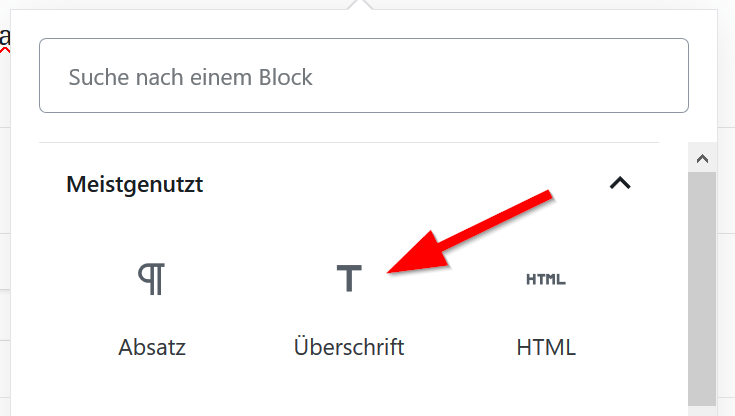
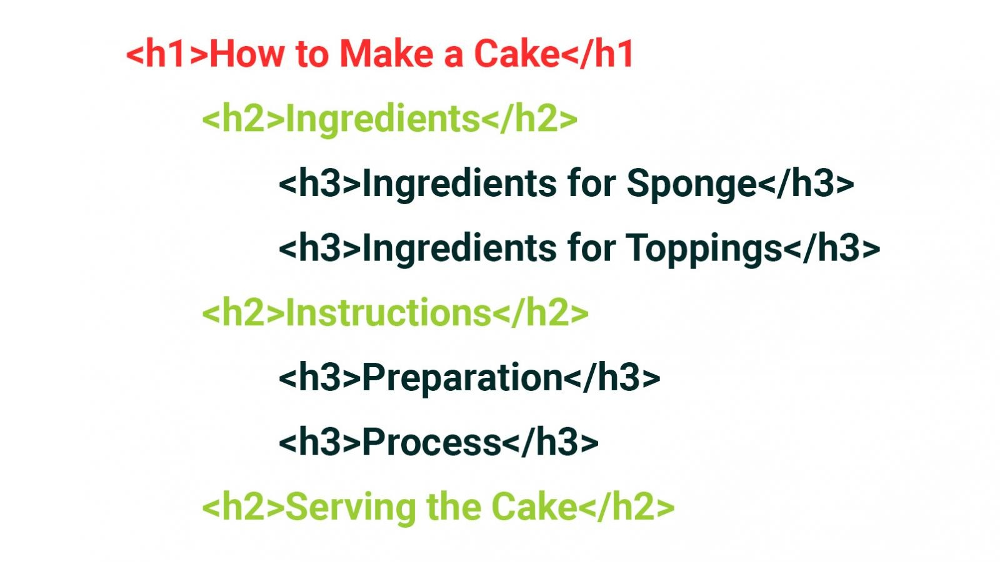
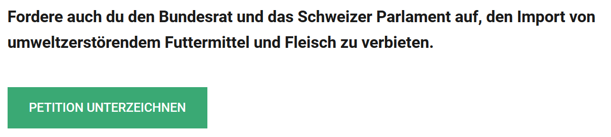
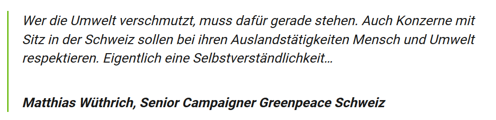
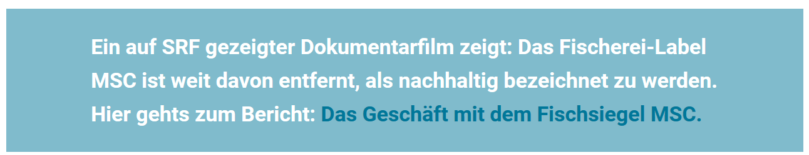

# Content Best Practices

When creating content for the website, please keep in mind a few best practices that help keep our readers happy and search engines informed.

## Think about your target group

Usually, our target group for stories is diverse. Think of all the people that visit our website. Will they understand the language you use? You may be an expert in the topic, but can you describe it in a way everyone understands?

## Structure your story

A good story consist of the following elements:

* Tags
* Title
* Author and date
* Featured image
* Lead: a first paragraph, formatted in bold, with a quick introduction to the topic
* Content: Well structured content made of text, headings, images, videos and other content elements.

### Use the correct heading

First of all: use the correct content block:

Then use the correct heading level: Headings are hierarchical: Imagine we generate a table of contents from your headings, what would it look like?

The first level \(h1\) is always reserved for the main title of the post. You can use levels h2 and h3 in your content \(and sometimes even h4\).


The heading level \(h1-h4\) should be selected according to the hierarchy you want to create in your content. Not based on how the title is formatted.


### Use the best fitting content elements

A good way to structure your text into more readable parts is using a variety of content blocks. Use images, videos and headlines, but there are more. Here are a few examples:

#### Repeat important statements:

#### Use buttons instead of links to bring out an important call to action:

#### Format citations using the citations block:

#### Use colored backgrounds to highlight a paragraph:

## Focus on readability

## Use images like a pro

## Entertain search engines

