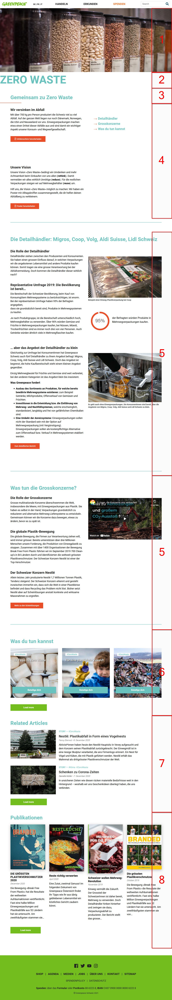
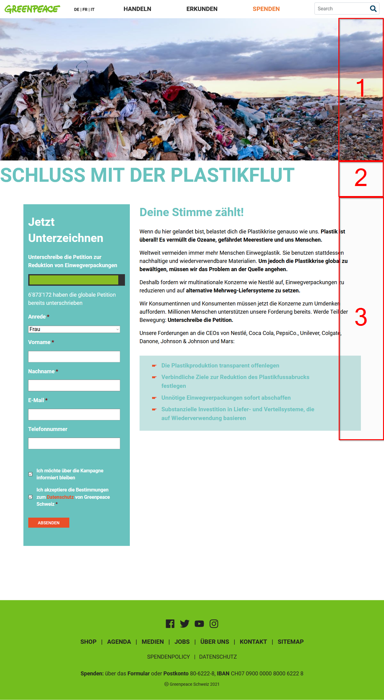
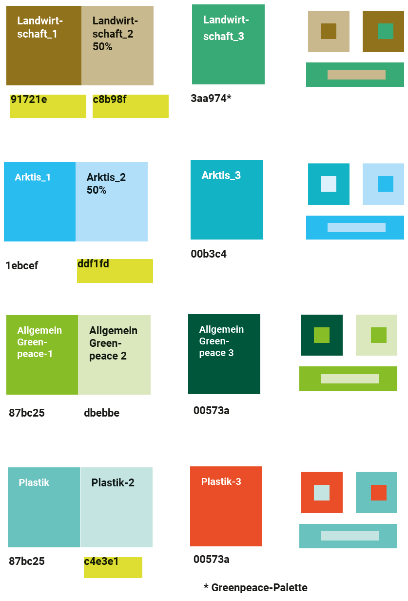
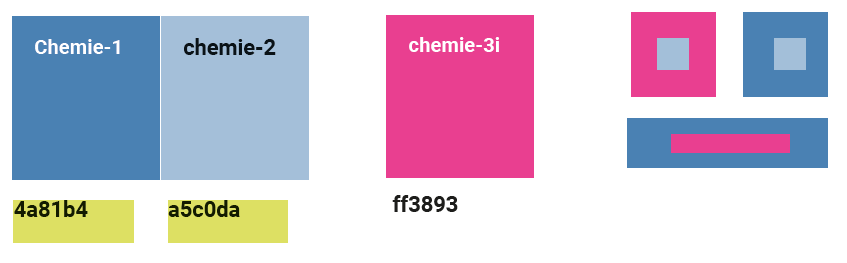
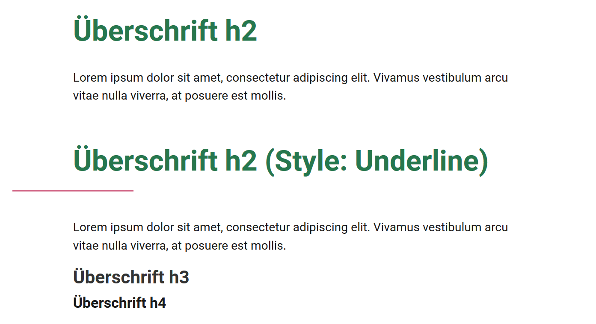

# Greenpeace.ch Styleguide

## Website structure

### Tag navigation

## Single page structure

### Explore pages

Explore pages are all pages with the primary intention to inform visitors about our campaigns, strategies.

| \# | Section | Description |
| :--- | :--- | :--- |
| 1 | Header image |  |
| 2 | Page Title |  |
| 3 | Subtitle | Formatted as h2 heading and style _underline_ |
| 4 | Two Column Element | Always leave column elements as 50% width per column. |
| 4a | Introduction | Introduces the topic in only a few sentences |
| 4b | In page menu | Lets users jump to sections on the page |
| 5a | Section title | Formatted as h2 heading |
| 5b | Two column content element | Usually text in the left column, images and video in the right column. |
| 5c | Separator Element |  |
|  | _Repeat 5a-5c_ | Repeat these elements for multiple subtopics within the page |
| 6 | Act section | Teasers for related act pages \(or general ones if no related activities are available\) |
| 7 | Posts section | Related stories and background articles |
| 8 | Publications section | Related publications |

### Act Pages

Act pages are intended for a single action that people can take to be part of our campaigns. Act pages are as short as possible while still explaining enough about why it is important to take this particular action.

| \# | Section | Description |
| :--- | :--- | :--- |
| 1 | Header Image |  |
| 2 | Page Title |  |
| 3 | Two column element | Formatted as style _petition column left_  |
| 3a | Petition or other forms |  |
| 3b | Content | Starts with a subtitle, formatted as h2. May contain text, images, videos and other content elements. |

### Posts

## Colors

The website uses multiple color schemes, depending on the campaign. The color scheme for a page is automatically set through the tags used on the page.

A standard color scheme is applied to all content that isn't related to one of the campaigns.

The following color schemes are available:

## Typography

Main font: Roboto \(Roboto LightRobotoRoboto MediumRoboto Bold\).

### Headings

| Level | Usage |
| :--- | :--- |
| h1 | Main page title \(only used once\) |
| h2 | Section title. Has two different styles, a normal one and underline |
| h3 | Section subtitle |
| h4-6 | Only used in exceptionally long content |

## Elements

### Forms

### Buttons

### Whitespace

## Additional Resources

* Design International: [https://planet4.greenpeace.org/start/vision-design/](https://planet4.greenpeace.org/start/vision-design/)
* Style Guide International: [https://planet4.greenpeace.org/start/style-guide/](https://planet4.greenpeace.org/start/style-guide/)

