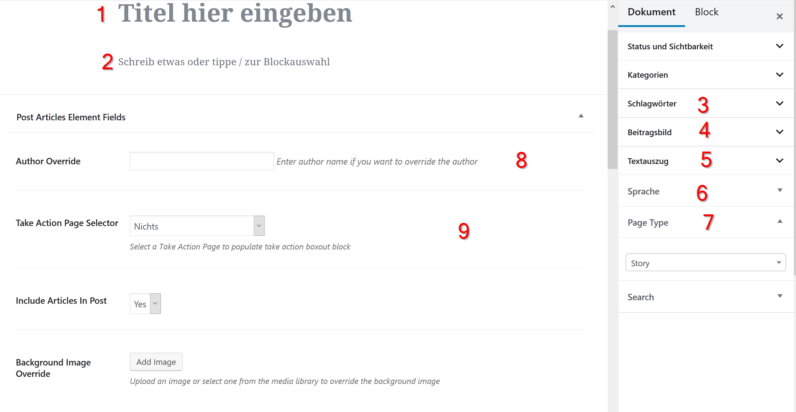
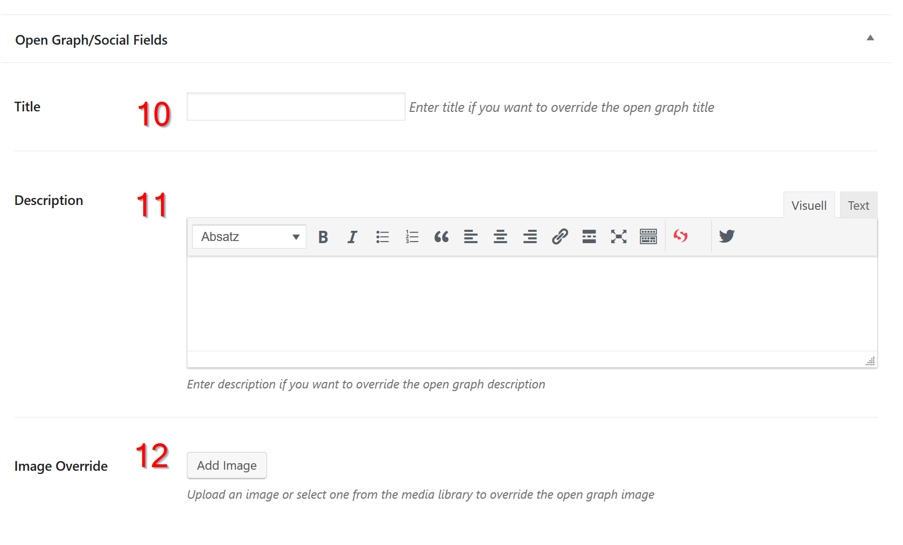

# Posts: Stories, Background Articles, Press Releases, Publications

All of these content types require you to add a new post, then use the settings to select what kind of post it is:

* Story
* Background Article
* Press Release
* Publication

1.  Start by going to Posts --&gt; Add new
2. Fill in the following fields:

<table>
  <thead>
    <tr>
      <th style="text-align:left">#</th>
      <th style="text-align:left">Element</th>
      <th style="text-align:left">Required?</th>
      <th style="text-align:left">Description</th>
    </tr>
  </thead>
  <tbody>
    <tr>
      <td style="text-align:left">1</td>
      <td style="text-align:left">Title</td>
      <td style="text-align:left">&#x2713;</td>
      <td style="text-align:left"></td>
    </tr>
    <tr>
      <td style="text-align:left">2</td>
      <td style="text-align:left">Content</td>
      <td style="text-align:left">&#x2713;</td>
      <td style="text-align:left">
        
Use the various blocks available to write the content of your post.

        
Start with a first paragraph that&apos;s formatted as bold text.

      </td>
    </tr>
    <tr>
      <td style="text-align:left">3</td>
      <td style="text-align:left">Tags</td>
      <td style="text-align:left">&#x2713;</td>
      <td style="text-align:left">Add at least one tag. Use only existing tags.</td>
    </tr>
    <tr>
      <td style="text-align:left">4</td>
      <td style="text-align:left">Featured Image</td>
      <td style="text-align:left">&#x2713;</td>
      <td style="text-align:left">
        
Depending on the post type:

        <ul>
          <li>Story/Press release, Background: Matching title image</li>
          <li>Publication: The title page of the publication in portrait orientation</li>
        </ul>
      </td>
    </tr>
    <tr>
      <td style="text-align:left">5</td>
      <td style="text-align:left">Excerpt</td>
      <td style="text-align:left">&#x2713;</td>
      <td style="text-align:left">Will be shown in the list view, not the single/detail view of a post.</td>
    </tr>
    <tr>
      <td style="text-align:left">6</td>
      <td style="text-align:left">Language</td>
      <td style="text-align:left">(&#x2713;)</td>
      <td style="text-align:left">Preset, doessn&apos;t need to be changed usually.</td>
    </tr>
    <tr>
      <td style="text-align:left">7</td>
      <td style="text-align:left">Post Type</td>
      <td style="text-align:left">&#x2713;</td>
      <td style="text-align:left">Default is Story, change it if you are writing a background article, press
        release or publication.</td>
    </tr>
    <tr>
      <td style="text-align:left">8</td>
      <td style="text-align:left">Author Override</td>
      <td style="text-align:left">(&#x2713;)</td>
      <td style="text-align:left">Overrides the author name that&apos;s displayed in the post. Use it if
        the author that gets displayed doesn&apos;t have a Wordpress user.</td>
    </tr>
    <tr>
      <td style="text-align:left">9</td>
      <td style="text-align:left">Take Action Element</td>
      <td style="text-align:left">(&#x2713;)</td>
      <td style="text-align:left">Shows a take action card beside your post.</td>
    </tr>
    <tr>
      <td style="text-align:left">10</td>
      <td style="text-align:left">Social Title</td>
      <td style="text-align:left">(&#x2713;)</td>
      <td style="text-align:left">Title for social sharing.</td>
    </tr>
    <tr>
      <td style="text-align:left">11</td>
      <td style="text-align:left">Social Description</td>
      <td style="text-align:left">(&#x2713;)</td>
      <td style="text-align:left">Description text for social sharing.</td>
    </tr>
    <tr>
      <td style="text-align:left">12</td>
      <td style="text-align:left">Social Image</td>
      <td style="text-align:left">(&#x2713;)</td>
      <td style="text-align:left">Social share image.</td>
    </tr>
  </tbody>
</table>


You don't need to set a category for posts, even though they are shown in the settings sidebar.


