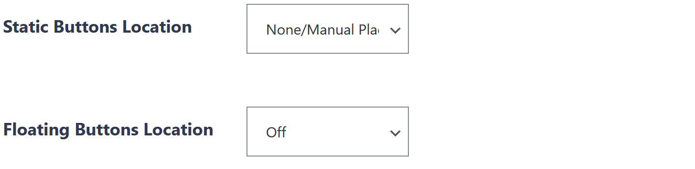

# Social Sharing

## Share Buttons

Most website pages contain share buttons automatically. You can also add them as a content block-

### Share buttons in content

Insert a content block "Social Warfare".


You can set the buttons to share a different page, for example to share a petition page even when displayed on a separate thank you page. 

Set the option _Should the buttons reflect this post, or a different post?_ to _Another Post_ and enter the page ID of the page to share in the following field.


### Remove automatically placed share buttons

If you add your own share buttons in the content of your page, you may want to remove the automatically placed buttons.

You can find the related setting below the content when editing the page:

## Prototype: P2P Sharing

Available only as a prototype so far. See the separate draft page for more information.

## Debugging social shares

Sometimes when sharing, your page is shared without an image or the text is wrong. Some social media services offer a debugger that tells you why your content isn't shared the way you'd like.

* Facebook: [https://developers.facebook.com/tools/debug/](https://developers.facebook.com/tools/debug/)
* Twitter: [https://cards-dev.twitter.com/validator](https://cards-dev.twitter.com/validator)


Social media platforms usually cache your content. When you change it, for example when you add a share image, it won't show up immediately. Using the debuggers speeds up the process, it forces them to grab the updated content from your page.


