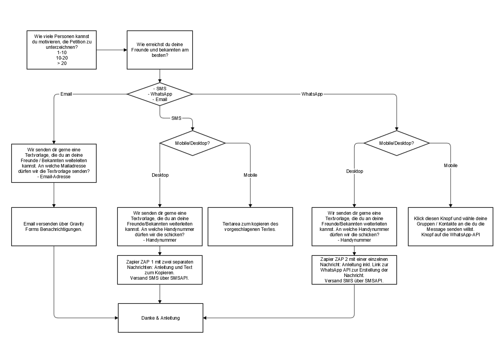

# P2P Sharing



### Benötigte Konten

* Zapier: Mit [webmaster@greenpeace.ch](mailto:webmaster@greenpeace.ch) anmelden \(Passwort im 1Password\)
* [SMS API](https://ssl.smsapi.com/): Login im 1Password \(auf webmaster@greenpeace.ch\)

### Verknüpfung mit Petitionsdaten

Es besteht die Möglichkeit, im P2P-Formular die Emailadresse des letzten ausgefüllten Gravity Forms zu speichern, sofern das nicht länger als 30 Minuten her ist. So kann die Email-Adresse eines Eintrags in der Petition auch in diesem Formular gespeichert werden. Das dient v.a. der Erstellung von Zielgruppen.

Dafür muss im P2P-Formular ein verstecktes Feld erstellt werden, das:

* Im Tab _Erweitert_ die Checkbox für "Erlaube die dynamische Befüllung dieses Feldes" aktiviert hat
* Im Tab _Erweitert_ den Parametername "form\_connect\_email" hat

### Einrichtung Prototyp

Die Formulare sind auf dieser Testseite eingebunden und können von dort kopiert werden: [https://www.greenpeace.ch/wp-admin/post.php?post=40785&action=edit&lang=de](https://www.greenpeace.ch/wp-admin/post.php?post=40785&action=edit&lang=de)

**Achtung:** Beide Formulare mitsamt den Tabellenblöcken kopieren. Die Tabellen-Blöcke enthalten Klassennamen, die die Anzeige nur auf grossen/kleinen Bildschirmen regeln. Formularblöcke können alleine keine Klassennamen enthalten.

Benötigte Texte: [https://docs.google.com/document/d/19kgiPhQe1u8pQwHZLms4snm68Zlw8Zk9s4qd7ADDaN4/edit?usp=sharing](https://docs.google.com/document/d/19kgiPhQe1u8pQwHZLms4snm68Zlw8Zk9s4qd7ADDaN4/edit?usp=sharing)

### Checklist, before you start

1. Alle möglichen Varianten testen: Email, WhatsApp, SMS in jeweils Desktop und Mobile \(die unterschiedlichen Versionen werden je nach Bildschirmbreite angezeigt\)
   1. Sind alle Texte korrekt?
   2. Werden Mails versendet, korrekte Inhalte per WhatsApp und SMS angezeigt/versendet?
   3. Funktionieren alle Kurzlinks?
   4. Enthalten die Kurzlinks die korrekten UTM Tags?
   5. Tauchen die UTM-Tags in Analytics auf \(Live-Ansicht im Analytics verwenden und Links klicken\)?
2. Bei Zapier ein Upgrade des Kontos machen auf mindestens 5000 Zaps. Dauernd beobachten, vor allem wenn ein Newsletter rausgeht und ggf. frühzeitig das Konto erhöhen auf 10'000 und weiter.
3. Bei SMS API Guthaben aufladen, so dass mindestens 2000-3000 SMS vorrätig sind. Ständig beobachten.


Wenn die Guthaben bei Zapier und SMSAPI auslaufen, funktioniert der Prozess nicht mehr und die NutzerInnen bekommen keine Fehlermeldung. Daher besser vorsichtig als nachsichtig die Konten auffüllen.


